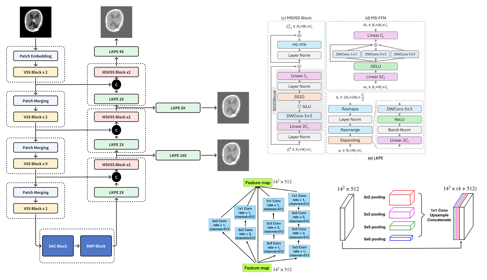

# MBH-Seg25: Multi-class Brain Hemorrhage Segmentation in Non-contrast CT

## Description
Inference repository for the 5th solution in the second edition of the MICCAI MBH-Seg25 Challenge on multi-class brain hemorrhage segmentation from non-contrast CT scans.

challenge website: [https://www.mbhseg.com/](https://www.mbhseg.com/)
leaderboard: [https://docs.google.com/spreadsheets/d/1X3IB5eFjXerPNnl1gWEvjYJqcOzXiP6Ac8OCKVTwAzw/edit?usp=sharing](https://docs.google.com/spreadsheets/d/1X3IB5eFjXerPNnl1gWEvjYJqcOzXiP6Ac8OCKVTwAzw/edit?usp=sharing)

## Model Details



## File Introduction
- `MBH-Seg25`: contains the predict code, model, and weights for MBH-Seg25.
- `mbh_seg.tar`: Docker image for MBH-Seg25.

## Quick Start

### 1. Install Dependencies
```bash
# Load the Docker image
docker load -i mbh_seg.tar 

# Run the Docker container
docker run -itd --gpus all --name mbh_seg mbh_seg:latest 

# Copy your data、code、weights to the container
docker cp /path/to/MBH-Seg25 mbh_seg:/workspace

# Access the container
docker exec -it mbh_seg -w /workspace /bin/bash 

# Install the dependencies
cd /workspace/MBH-Seg25/selective_scan
pip install -e .
```

### 2. Prepare Test Data
```
MBH_Test_label_2025/
    ├── ID_90ae3af3_ID_8d77fcb5d2/
    │   ├── image.nii.gz
    │   ├── label_annot_1.nii.gz
    │   └── label_annot_5.nii.gz
    ├── ID_066b1fc2_ID_f937d7bff0/
    │   ├── image.nii.gz
    │   ├── label_annot_1.nii.gz
    │   └── label_annot_5.nii.gz
    └── ID_0219ef88_ID_e5c1a31210/
        ├── image.nii.gz
        ├── label_annot_1.nii.gz
        └── label_annot_5.nii.gz
```
- `folder name`: ID of the patient
- `image.nii.gz`: The input image for segmentation.
- `label_annot_*.nii.gz`: The ground truth label for the annotation.

```bash
# Copy test data to the container
docker cp /path/to/MBH_Test_label_2025 mbh_seg:/workspace/MBH-Seg25
```

### 3. Predict Test Data
```bash
# Access the container
docker exec -it mbh_seg -w /workspace /bin/bash 

cd /workspace/MBH-Seg25
python stroke_predict.py --input_dir /workspace/MBH-Seg25/MBH_Test_label_2025 --output_dir /workspace/MBH-Seg25/predictions
```

### 4. Evaluation with Evaluation Tool

The toolkit automatically detects your data structure and parameters.

#### ID-based structure (like MBH dataset)

```
project/
├── predictions/
│   ├── ID_90ae3af3_ID_8d77fcb5d2.nii.gz
│   ├── ID_066b1fc2_ID_f937d7bff0.nii.gz
│   └── ID_0219ef88_ID_e5c1a31210.nii.gz
└── MBH_Test_label_2025/
    ├── ID_90ae3af3_ID_8d77fcb5d2/
    │   ├── image.nii.gz
    │   ├── label_annot_1.nii.gz
    │   └── label_annot_5.nii.gz
    ├── ID_066b1fc2_ID_f937d7bff0/
    │   ├── image.nii.gz
    │   ├── label_annot_1.nii.gz
    │   └── label_annot_5.nii.gz
    └── ID_0219ef88_ID_e5c1a31210/
        ├── image.nii.gz
        ├── label_annot_1.nii.gz
        └── label_annot_5.nii.gz
```

**Note**: Prediction filenames must match the folder names in the labels directory for correct evaluation.


For most evaluation needs, simply use:

```bash
# Access the container
docker exec -it mbh_seg -w /workspace /bin/bash 

cd /workspace/MBH-Seg25
python competition_evaluation.py --pred_path /workspace/MBH-Seg25/predictions --gt_path /workspace/MBH-Seg25/MBH_Test_label_2025
```

This command automatically:
- Detects all prediction files in your predictions directory
- Matches them with corresponding annotation folders
- Evaluates using appropriate metrics
- Handles ID-based naming (like MBH dataset structure)

## Evaluation Metrics

### Diverse Performance Metrics (Set-Level)
- **GED (Generalized Energy Distance)**: Set-level similarity between prediction and annotation sets
- **Dice_max**: Maximum Dice score achievable through optimal matching
- **Dice_match**: Dice score using Hungarian algorithm optimal matching
- **Dice_soft**: Soft Dice coefficient accounting for all annotation variations

### Personalized Performance Metrics
- **Individual Dice Scores**: Per-annotator Dice coefficients
- **Statistical Summary**: Mean, standard deviation, min/max across annotators

## Data Format Requirements

- **File Format**: NIfTI (`.nii.gz`)
- **Segmentation Maps**: Integer class indices (0, 1, 2, ...) or binary (0, 1)
- **Spatial Consistency**: All files must have matching dimensions
- **Class Handling**: Supports sparse class indices (e.g., [0, 2, 5])
- **ID Matching**: For MBH-style datasets, prediction filenames must exactly match the corresponding annotation folder names


## Output

Final evaluation results for all samples are saved in the `competition_results/` folder:
- `competition_aggregate_results.json` - Summary metrics across all samples
- `competition_detailed_results.json` - Detailed per-sample results
- `competition_report.txt` - Human-readable evaluation report
